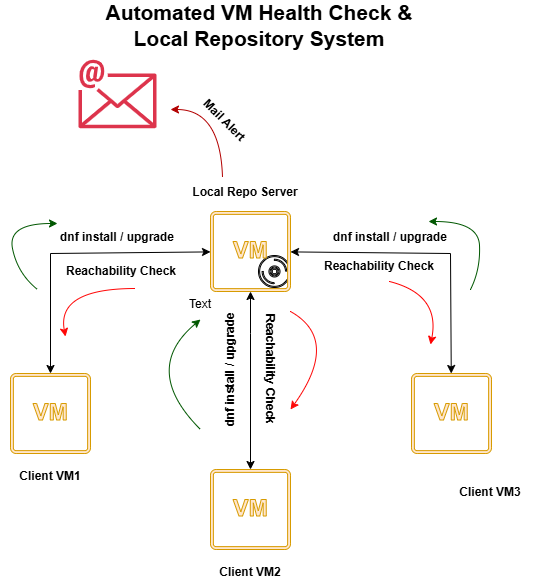

# 🧠 Project: VM Health & Local Repository Automation

## 📘 System Overview
This project is a **practical implementation of Red Hat System Administration I & II (RH124 & RH134)** concepts.  
It focuses on automating essential system administration tasks such as **repository management**, **VM health monitoring**, and **service scheduling** — all using **Bash scripts** on **RHEL 9**.

The repository consists of two main components:

- **Check Reachability**  
  A Bash script that checks the reachability and health status of virtual machines (VMs).  
  It uses **systemd service and timer units** to run automatically at fixed intervals.  
  If a VM becomes unreachable, **Mailx** sends an email alert to the administrator for immediate action.

- **Local Repository Setup**  
  A Bash automation script that configures a server as a **local YUM repository**, enabling other VMs to install or update packages directly from it.  
  This setup ensures faster installations, offline support, and central package management.

Together, these scripts form a self-contained system that simulates a real-world RHEL enterprise environment.

---

## 🧩 Project Structure
check-reachability/
│
├── scripts/
│ └── check_reachability.sh
│
├── systemd/
│ ├── check_reachability.service
│ └── check_reachability.timer
│
├── config/
│ └── mailrc
│
└── README.md

└── local_repo/
  └── setup_local_repo.sh

---

## ⚙️ Key Features
- **Automated VM health checks**
- **Mailx email alerts** for unreachable machines
- **systemd service & timer automation**
- **Local YUM repository setup for RHEL 9**
- **Offline package installation**
- **Centralized package management for multiple VMs**
- **Practical Red Hat system administration automation**

---

## 🚀 Future Improvements
- Add CPU, RAM, and Disk usage monitoring  
- Integrate with AWS SNS or Slack for alerting  
- Support multiple email recipients  
- Add REST API endpoint for reporting health status  

---

## 🧩 Technologies Used
- **Bash (Shell Scripting)**
- **Linux / RHEL 9**
- **Mailx** (Email notifications)
- **systemd Service & Timer**
- **YUM / DNF Repository Management**

---

## 🖼️ System Diagram

_This diagram illustrates how the Admin VM performs reachability checks, installs/updates via the local repo, and sends alerts to the admin email._

---

## 🎯 Educational Context
This repository was built as part of practicing **Red Hat System Administration I & II (RH124 & RH134)**.  
It demonstrates:
- Managing YUM repositories  
- Configuring services and system timers  
- Monitoring VMs automatically  
- Sending email alerts using Mailx  
- Automating administrative tasks via Bash scripting  

---

## 👨‍💻 Author
**Abdelrahman Shahin**  
DevOps & Cloud Enthusiast | Red Hat   

