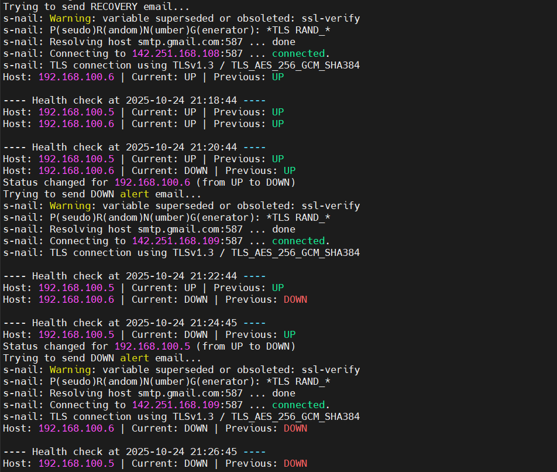
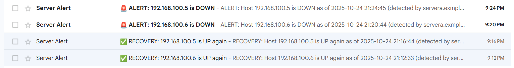

# 🧠 Project: Check-Reachability (VM Health Monitoring System)

## 📘 Overview
**Check-Reachability** is a simple yet powerful Linux-based monitoring system designed to check the reachability and health of virtual machines (VMs) running on a Red Hat Enterprise Linux (RHEL) environment.  
The script periodically tests network connectivity, logs results, and sends automatic email notifications to the admin.

---

## ⚙️ Main Components
- **Red Hat Enterprise Linux VMs**
- **Bash Script** – performs the reachability check  
- **systemd Service & Timer** – automates script execution  
- **mailx / Postfix** – sends email alerts  

---

## 🔍 How It Works
1. The script pings or SSH-checks all configured VMs.  
2. Results are logged in `health_check.log`.  
3. If all servers are reachable → an “All OK” email is sent.  
4. If one or more servers are down → an alert email is sent.  
5. The process repeats automatically using **systemd timer**.

---

## 🖼️ Documentation Images  

| Screenshot | Description |
|-------------|--------------|
|  | Example of the log file showing host status |
|  | Email notification received when a server goes down |

---

## 🧠 Future Improvements
- Add CPU, RAM, and Disk usage checks  
- Integrate with AWS SNS or Slack for alerts  
- Support multiple email recipients  
- Add REST API endpoint for health status reporting  

---

## 👨‍💻 Developer
**Abdelrahman Shahin**  
DevOps Engineer | Linux & Cloud Enthusiast  

📧 Email: abdelrahman.m.27.22@gmail.com  
🌐 GitHub: [https://github.com/Abdelrahman753](https://github.com/Abdelrahman753)
